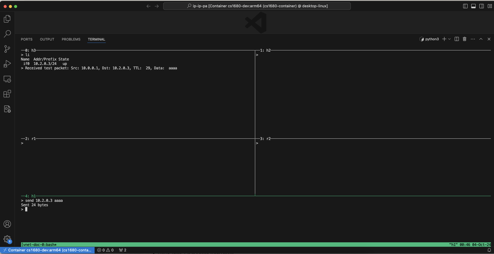
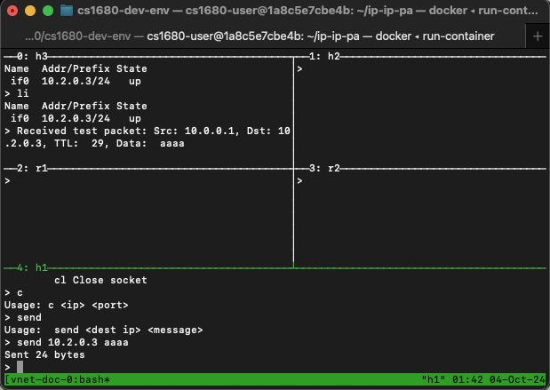

# Milestone Questions:
- What are the different parts of your IP stack and what data structures do they use? How do these parts interact (API functions, channels, shared data, etc.)?

Different parts of IP Stack use Interface structs, IPStack struct, and potentially an IPacket struct. 
More struct information below.
Each node will initialize its own IPStack struct, then each interface will have its own thread to receive and send packets on.
The shared data between the interfaces on one node is the IPStack.
The API functions will be called on an IPStack struct in an interface thread.
- What fields in the IP packet are read to determine how to forward a packet?

The TTL, checksum, IP options, and destination IP

- What will you do with a packet destined for local delivery (ie, destination IP == your node’s IP)?

Handled in receive function, will look at protocolNum to find corresponding callback function to handle and propagate upwards.

- What structures will you use to store routing/forwarding information?

Forwarding information is stored in a map from net mask to interface struct.
Interface struct contains udp port and ip.
Routing information is stored in a routing table. 
The two types Host and Router will implicitly use IPStack fields either forwarding table or routing table, respectively. 

- What happens when a link is disabled? (ie, how is forwarding affected)?

The packet is dropped? Try to send the packet, but send fails

## Screenshots





## Code Chunks

```
vhost/vrouter
main():
// general flow
IPStack = Initialize()
For each interface in IPStack.interfaces:
	Go handleInterface(IPStack)

For {
 // read in REPL commands appropriately
}

handleInterface(IPStack, Interface):
// thread for handle interface
```


## IP Stack API
```
type IPStack struct {
Forward_table map[netip.Prefix]Interface // maps IP prefixes to interfaces
	Handler_table map[int]HandlerFunc        // maps protocol numbers to handlers
	Interfaces    map[string]*Interface      // maps interface names to interfaces
	Ip            netip.Addr                 // the IP address of this node
	Mutex         sync.Mutex                 // for concurrency
}
```

```
type Router struct {
Routing_table map[string](int, *Interface) // maps dest to tuple of (cost, neighbor)
Stack IPStack // contains base IPStack fields, so that interface functions can be called on Router struct
Update_rate int // periodic update rate for router to update neighbors
Timeout int // timeout threshold before route expiress
}
```

```
type Host struct {
Forward_table map[netip.Prefix]Interface // maps IP prefixes to interfaces
	stack IPStack // contains base IPStack fields, so that interface functions can be called on Host struct
}
```

```
type Interface struct {
	Name   string       	// the name of the interface
	IP     netip.Addr   	// the IP address of the interface on this host
	Neighbors     map[netip.Addr]Interface   // maps (virtual) IPs to Interfaces
	Prefix netip.Prefix 	// the network submask/prefix
	Udp    net.UDPAddr  	// the UDP address of the interface on this host
	Down   bool         	// whether the interface is down or not
	Listener *net.UDPConn // listen to incoming UDP packets
}
```

```
type IPPacket struct {
	Header ipv4header.IPv4Header,
	Payload []byte,
}
```

```
type IPStackAPI interface {
	Initialize(configInfo)
	ReceiveIP(updConn)
	SendIP(udpConn)
	RegisterRecvHandler(protocolNum uint16, callbackFunc HandlerFunc)
}
```

```
Initialize(configInfo IpConfig) (*IPStack, error):
	Use data from lnx file to populate an IPStack struct
Populating forward table 
Populating neighbors map
Fill in node’s IP
Populate interfaces
For each interface, need name, IP, prefix, Udp, Down=False, conn
Need thread for each interface to listen for packets
```

```
ReceiveIP(udpConn):
	Listen on udpConn
	Once you get packet, do packet checking
	
	// in a helper:
If packet has IP options drop packet?
Recompute checksum
Verify TTL > 0

	If packet checker helper returns true:
		If packet destination IP == interface IP:
use Stack map’s handler_table to call correct callback function

	If packet destination IP != interface IP:
		Check forwarding table to see which interface it should go to, get the interface struct and find its IP and then pass that IP to sendIP function. 
		SendIP(Stack, destination, protocol, data)
```	

```
SendIP(dest netip.Addr, protocolNum uint16, data []byte):
	Construct header, marshal header
	Marshal payload bytes
	Append them together
	In a loop, until leaf case is reached (leaf case = interface):
	Use forwarding table to get next Interface struct and to get the conn
	If interface field down is true, then don’t send, return err?
```

```
RegisterRecvHandler(protocolNum uint16, callbackFunc HandlerFunc):
Modify IPStack struct’s handler_table by adding protocolNum as key and callbackFunc as value.
```

# README:
## Project Background Information
We’re going to build the functionality for a host and a router and they are 2 separate programs that live in user space (vhost and vrouter). The lowest level entity in these programs is a socket and that simulates sending on an interface. We’re building packets and then putting packets in the UDP socket (every interface has a UDP port to send and receive packets on that interface).

In terms of the network, a network is made of nodes: nodes are either hosts or routers. Every node has one or more interfaces. More specifically, in this project, a host has only 1 interface in this project while a router can have multiple interfaces. You can also have links between hosts and routers. 

The network is divided into subnets. Every grouping of edges between a router makes up a subnet and this subnet has an IP prefix. All nodes on the same subnet are considered to be neighbors.

## IP Packet Forwarding

### IP Packet Structure
In order to build out the functionality for IP packet forwarding, we first define how an IP packet is represented in our code. An IP packet will likely be a struct that contains the following information:

```
type IPPacket struct {
	Header ipv4header.IPv4Header,
	Payload []byte,
}
```

The header field within this struct contains most of the information we need, such as the checksum, TTL, options, etc. We define our payload to be a byte array (we also want a way to manually define the IP packet’s initial TTL to be 16). Whenever we forward a packet to its destination, we have to decrement the packet’s TTL value and recompute its checksum by extracting the checksum from the header (in our code, we will also have a helper function to compute the checksum).

In the event where the TTL is 0 or the recomputed checksum is invalid (the re-computed checksum doesn’t equal the original checksum), we want to drop the packet (we’re assuming “dropping” the packet means something like returning from the function that called it or not adding it to a queue or something like that).

## Interface Structure
Each node (host or router) possesses 1 or more interfaces. We can define an interface as a data type that encapsulates both a host and a router. In terms of the code, we simulate an interface using a UDP socket. Its struct is defined to be

```
type Interface struct {
	Name   string       	// the name of the interface
	IP     netip.Addr   	// the IP address of the interface on this host
	Prefix netip.Prefix 	// the network submask/prefix
	Udp    net.UDPAddr  	// the UDP address of the interface on this host
	Down   bool         	// whether the interface is down or not
	Listener *net.UDPConn // listen to incoming UDP packets
}
```

The Udp field contains information about the UDP port on which to send packets to. We will also maintain a global list of interfaces somewhere. Note that the interface’s IP address lives only within the network and it must be within this subnet. Each interface also has its own port number. 

## IP API

### Overall Design and Functions
Our IP API is designed to provide shared implementation code between our vhost and vrouter programs. In other words, it is a reusable library that can be used by both routers and hosts.

Our IP API will contain the following functions:

`initialize(configInfo IpConfig) (error)`

This function will take in a lnx/configuration file that contains the nodes, neighbors, interfaces, routes, etc. that we need to initialize our IP stack. We are looking to pass in an instance of an IpAPI (which is either a host or a router) and essentially populate the fields of that struct. Note that we would also use this function to initialize any global variables (if we end up using any).

`receive():`

The thinking we had for this receive packet is that it needs to have some sort of packet-checking functionality in it. This means that we first read in the packet from somewhere (i.e. a channel), parse the packet, check if the header is valid (verify the checksum and the TTL), update the TTL, and then forward the packet by calling the forward() function.

If at any point, the packet is not valid (more specifically, any of its fields aren’t valid), then we drop it (return nil). 

`SendIP(api *IP_API, dest netip.Addr, protocolNum uint16, data []byte):`

This function is used to send an IP packet. At this point, we know that the packet is valid and we have to consult our forwarding table to determine whether it’s for this host, something else on the local network, or some other node in a different network. This forwarding table is stored as a field of the IpAPI struct. 

`RegisterRecvHandler(api *IP_API, protocolNum uint16, callbackFunc HandlerFunc):`

We call this function when we get a packet with protocol number protocolNum. This function receives a packet and then “connects” it to higher layers of the networking stack that will process them. This is what the callback function is for. In other words, for a given protocol number, our API will register this callback function that gets called when you receive a valid packet of that type.

## IP API Struct

Our IP API struct is designed to be an interface-like (“interface” in the sense of shared functionality and behavior) type that both routers and hosts will implement. For example, both routers and host nodes will have a forward table map, so we’ve decided to incorporate that as a field for a struct to be used by both entities.

```
type IP_API struct {
    Forward_table map[netip.Prefix]Route  // maps IP prefixes to routes
	Handler_table map[int]HandlerFunc     // maps protocol numbers to handlers
	Neighbors     map[netip.Addr]Neighbor // maps (virtual) IPs to UDP ports
	Interfaces    map[string]*Interface   // maps interface names to interfaces
	Ips           []netip.Addr            // the IP addresses of this node
	ReadChannel   chan []byte             // channel for reading packets
	Mutex         sync.Mutex              
}
```

The forwarding table is used for both 

We also noted that each node (router or host) can have one or more interfaces, so to prevent the need from using 2 different types, we just have a list that stores these interface(s).

Neighbors are defined as the nodes that the current node can reach directly (share the same subnet with).

## Use of Threads/Goroutines

### CLI Threads
Just like in Snowcast, in our vhost and vrouter programs, we will have a goroutine/thread to handle CLI commands that can be used to send packets and prine out information. These goroutine functions will be called from the main thread (main()). 

### Cron Job Thread (for RIP)
We’re thinking of having a separate goroutine that runs periodically to remove timed-out connections from the routing table. It checks the timestamps of when routes were created and removes entries that haven't been updated within the specified time frame. 

### Receiving and Forwarding Thread
We want to have a separate goroutine that handles the receiving and forwarding of IP packets in both the host and router programs.

How you build your abstractions for the IP layer and interfaces (What data structures do you have? How do your vhost and vrouter programs interact with your shared IP stack code?)
The steps you will need to process IP packets

# Miscellaneous

## Questions to ask TA:
Are there any design considerations for IP that you would suggest in order to make implementing TCP later on easier?
Does each vhost, vrouter running create a new instance of an IPStack object from the API?
Should we have a thread for each Interface, since they each have UDP ports to listen on?
Does a disabled link mean the interface is down?
What happens when a link is disabled? (ie, how is forwarding affected)?
Would we have to exit out of the goroutine that is running that interface? But we also need to be able to bring the interface back up again?
If packet has IP options, drop packet, but also in handout if packet has extra fields, ignore extra fields and continue normally?
We’re not implementing ARP? Why not? And so do we need the MAC address?
Sending both header + payload together in one send?
What does protocolNum do in Send?
If it’s for receiver to construct protocolNum, can’t receiver just reconstruct it from packet bytes?
Statics vs RIP routing? So route in .lnx is for static routing, which is used to construct node forwarding table?
How are routing updates being sent? Should include router specific methods in a separate Router interface?


# Notes:
Host and router should be using the same interface to forward and receive packets. Both the host and the router will use the same code to forward packets.
Routers use RIP to communicate with other routers

Our network could be connected in a loop. The routers will have to talk to each other and tell each other about their networks, and part of that will be resolving loops. 

At startup, routers only know about their local networks. The idea of the routing algorithm is to tell other routers about your routes and build a global picture of the whole network.

From the software side, you have the notion of your IP stack. You write this code to do IP forwarding, and you should write this as a library so you can just import it into your vhost and vrouter. You only want to write this code once, so it’s the same logic just being used a little differently depending on whether we’re dealing with a host vs. a router.  